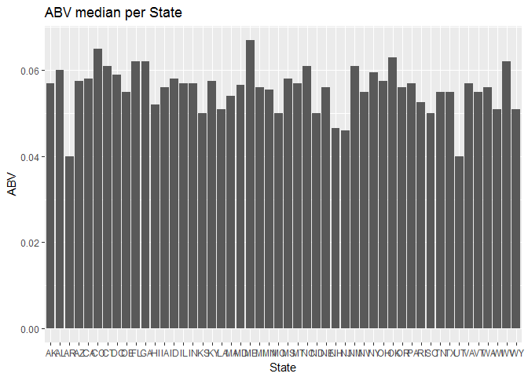
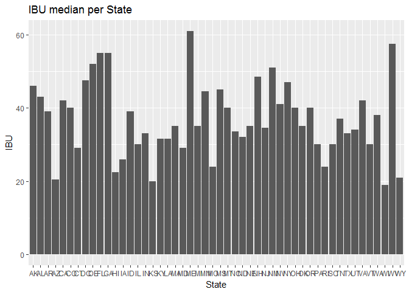

# SKC_MSDS6306_Casestudy01
sabitri kc  
June 30, 2017  


## Introduction
The purpose of this presentation is to provide the analysis of two data sets called "Beers" and "Breweries".Beers dataset contains a list of 2410 US craft beers and Breweries dataset contains 558 US breweries.The datasets descriptions are as follows:

####Beers.csv:
* Name: Name of the beer. 
* Beer ID: Unique identifier of the beer. 
* ABV: Alcohol by volume of the beer. 
* IBU: International Bitterness Units of the beer. 
* Brewery ID: Brewery id associated with the beer. 
* Style: Style of the beer. Ounces: Ounces of beer.

####Breweries.csv: 
* Brew ID: Unique identifier of the brewery.
* Name: Name of the brewery. 
* City: City where the brewery is located. 
* State: State where the brewery is located.

**SessionInfo:**
R version 3.4.0 (2017-04-21)
Platform: x86_64-w64-mingw32/x64 (64-bit)
Running under: Windows >= 8 x64 (build 9200)

##Setup Requirement

```r
# install and load following packages:
library(dplyr)
```

```
## 
## Attaching package: 'dplyr'
```

```
## The following objects are masked from 'package:stats':
## 
##     filter, lag
```

```
## The following objects are masked from 'package:base':
## 
##     intersect, setdiff, setequal, union
```

```r
library(ggplot2)
```

```r
# Find out the working directory
setwd("C:/DOING DATA SCIENCE 6306/Unit 7/CaseStudy_01/Data")
getwd()
```

```
## [1] "C:/DOING DATA SCIENCE 6306/Unit 7/CaseStudy_01/Data"
```

```r
# Load the data from csv file and stored in data frame
beerdata <- read.csv("Beers.csv" , TRUE, ",")
 class(beerdata)
```

```
## [1] "data.frame"
```

```r
 dim(beerdata)
```

```
## [1] 2410    7
```

```r
 head(beerdata)
```

```
##                  Name Beer_ID   ABV IBU Brewery_id
## 1            Pub Beer    1436 0.050  NA        409
## 2         Devil's Cup    2265 0.066  NA        178
## 3 Rise of the Phoenix    2264 0.071  NA        178
## 4            Sinister    2263 0.090  NA        178
## 5       Sex and Candy    2262 0.075  NA        178
## 6        Black Exodus    2261 0.077  NA        178
##                            Style Ounces
## 1            American Pale Lager     12
## 2        American Pale Ale (APA)     12
## 3                   American IPA     12
## 4 American Double / Imperial IPA     12
## 5                   American IPA     12
## 6                  Oatmeal Stout     12
```

```r
breweriesdata <- read.csv("Breweries.csv" , TRUE, ",")
class(breweriesdata)
```

```
## [1] "data.frame"
```

```r
dim(breweriesdata)
```

```
## [1] 558   4
```

```r
head(breweriesdata)
```

```
##   Brew_ID                      Name          City State
## 1       1        NorthGate Brewing    Minneapolis    MN
## 2       2 Against the Grain Brewery    Louisville    KY
## 3       3  Jack's Abby Craft Lagers    Framingham    MA
## 4       4 Mike Hess Brewing Company     San Diego    CA
## 5       5   Fort Point Beer Company San Francisco    CA
## 6       6     COAST Brewing Company    Charleston    SC
```
## Analysis of data:

```r
#Total number of breweries present in each state.
noofbreweries <- aggregate(rep(1, length(breweriesdata$State)), by=list(breweriesdata$State), sum )
noofbreweries
```

```
##    Group.1  x
## 1       AK  7
## 2       AL  3
## 3       AR  2
## 4       AZ 11
## 5       CA 39
## 6       CO 47
## 7       CT  8
## 8       DC  1
## 9       DE  2
## 10      FL 15
## 11      GA  7
## 12      HI  4
## 13      IA  5
## 14      ID  5
## 15      IL 18
## 16      IN 22
## 17      KS  3
## 18      KY  4
## 19      LA  5
## 20      MA 23
## 21      MD  7
## 22      ME  9
## 23      MI 32
## 24      MN 12
## 25      MO  9
## 26      MS  2
## 27      MT  9
## 28      NC 19
## 29      ND  1
## 30      NE  5
## 31      NH  3
## 32      NJ  3
## 33      NM  4
## 34      NV  2
## 35      NY 16
## 36      OH 15
## 37      OK  6
## 38      OR 29
## 39      PA 25
## 40      RI  5
## 41      SC  4
## 42      SD  1
## 43      TN  3
## 44      TX 28
## 45      UT  4
## 46      VA 16
## 47      VT 10
## 48      WA 23
## 49      WI 20
## 50      WV  1
## 51      WY  4
```

```r
# Merge beerdata and breweriesdata by brewery id and stored in new data frame called m1 :
m1 <- merge(beerdata, breweriesdata, by.x = "Brewery_id" , by.y="Brew_ID")

#checking first 6 observations and last 6 observations of the merged data frame m1 :
head(m1)
```

```
##   Brewery_id        Name.x Beer_ID   ABV IBU
## 1          1  Get Together    2692 0.045  50
## 2          1 Maggie's Leap    2691 0.049  26
## 3          1    Wall's End    2690 0.048  19
## 4          1       Pumpion    2689 0.060  38
## 5          1    Stronghold    2688 0.060  25
## 6          1   Parapet ESB    2687 0.056  47
##                                 Style Ounces             Name.y
## 1                        American IPA     16 NorthGate Brewing 
## 2                  Milk / Sweet Stout     16 NorthGate Brewing 
## 3                   English Brown Ale     16 NorthGate Brewing 
## 4                         Pumpkin Ale     16 NorthGate Brewing 
## 5                     American Porter     16 NorthGate Brewing 
## 6 Extra Special / Strong Bitter (ESB)     16 NorthGate Brewing 
##          City State
## 1 Minneapolis    MN
## 2 Minneapolis    MN
## 3 Minneapolis    MN
## 4 Minneapolis    MN
## 5 Minneapolis    MN
## 6 Minneapolis    MN
```

```r
tail(m1)
```

```
##      Brewery_id                    Name.x Beer_ID   ABV IBU
## 2405        556             Pilsner Ukiah      98 0.055  NA
## 2406        557  Heinnieweisse Weissebier      52 0.049  NA
## 2407        557           Snapperhead IPA      51 0.068  NA
## 2408        557         Moo Thunder Stout      50 0.049  NA
## 2409        557         Porkslap Pale Ale      49 0.043  NA
## 2410        558 Urban Wilderness Pale Ale      30 0.049  NA
##                        Style Ounces                        Name.y
## 2405         German Pilsener     12         Ukiah Brewing Company
## 2406              Hefeweizen     12       Butternuts Beer and Ale
## 2407            American IPA     12       Butternuts Beer and Ale
## 2408      Milk / Sweet Stout     12       Butternuts Beer and Ale
## 2409 American Pale Ale (APA)     12       Butternuts Beer and Ale
## 2410        English Pale Ale     12 Sleeping Lady Brewing Company
##               City State
## 2405         Ukiah    CA
## 2406 Garrattsville    NY
## 2407 Garrattsville    NY
## 2408 Garrattsville    NY
## 2409 Garrattsville    NY
## 2410     Anchorage    AK
```

```r
#Total no of NA's and spaces in each column :
library(dplyr)
newm1 <- replace(m1,m1=="",NA)
m2 <- apply(newm1,2,function(x){sum(is.na(x))})
m2
```

```
## Brewery_id     Name.x    Beer_ID        ABV        IBU      Style 
##          0          0          0         62       1005          5 
##     Ounces     Name.y       City      State 
##          0          0          0          0
```

```r
#To compute the median alcohol content and international bitterness unit for each state :
m3 <- aggregate(cbind(newm1$ABV,newm1$IBU)~State,FUN = median,newm1,na.rm=TRUE)
head(m3)
```

```
##   State     V1   V2
## 1    AK 0.0570 46.0
## 2    AL 0.0600 43.0
## 3    AR 0.0400 39.0
## 4    AZ 0.0575 20.5
## 5    CA 0.0580 42.0
## 6    CO 0.0650 40.0
```

```r
# we can plot the bar chart for better visualisation and to compare between alcohol content and international bitterness unit for each state:
ggplot(m3,aes(m3$State, y = m3$V1))+geom_bar(stat = "identity")+labs(x = "State" , y = "ABV") + ggtitle("ABV median per State")
```

<!-- -->

```r
ggplot(m3,aes(m3$State, y = m3$V2))+geom_bar(stat = "identity")+labs(x = "State" , y = "IBU") + ggtitle("IBU median per State")
```

<!-- -->

```r
# From the bar chart for median alcohol content and international bitterness unit by states indicates that most of the states are above 0.05 range and states with more alcohol content have more international bitterness unit of beer.
```


```r
#Finding state with maximum alcoholic beer and the most bitter beer:
m1[which.max(m1$ABV),]
```

```
##     Brewery_id                                               Name.x
## 375         52 Lee Hill Series Vol. 5 - Belgian Style Quadrupel Ale
##     Beer_ID   ABV IBU            Style Ounces                  Name.y
## 375    2565 0.128  NA Quadrupel (Quad)   19.2 Upslope Brewing Company
##        City State
## 375 Boulder    CO
```

```r
m1[which.max(m1$IBU),]
```

```
##      Brewery_id                    Name.x Beer_ID   ABV IBU
## 1857        375 Bitter Bitch Imperial IPA     980 0.082 138
##                               Style Ounces                  Name.y    City
## 1857 American Double / Imperial IPA     12 Astoria Brewing Company Astoria
##      State
## 1857    OR
```

```r
#The state with the most bitter beer (IBU) is:OR with IBU=138
#The state with the maximum alcoholic beer (ABV) is:CO with ABU=0.128
```

```r
#summary statistics for ABV(Alcohol by volume) variable:
statistics <- summary(m1$ABV)
statistics
```

```
##    Min. 1st Qu.  Median    Mean 3rd Qu.    Max.    NA's 
## 0.00100 0.05000 0.05600 0.05977 0.06700 0.12800      62
```

```r
# To draw scatterplot to find the relationship between the bitterness of the beer and its alcoholic content:
ggplot(beerdata,aes(x = ABV,y = IBU ))+geom_point(na.rm=TRUE)+geom_smooth(method=lm,se=FALSE, na.rm=TRUE)
```

<!-- -->

```r
# From the above scatterplot between ABV vs IBU,It is clearly seen that the if the alcohol content is increased the bitterness of beer also increased.so ABV and IBU have positive correlation even though there are some outliers in the data.
```

##Conclusion:
After the complete analysis of beers and breweries datasets,we can conclude that CO has the maximum alcohiolic beer with ABV=0.128, and OR has the most bitter beer with IBU=138.We were able to compute median alcohol content with summary statistics and international bitterness unit.For the better visualisation,we plot bar chart and scatterplot which also shows that there is a positive correlation between ABV and IBU.


